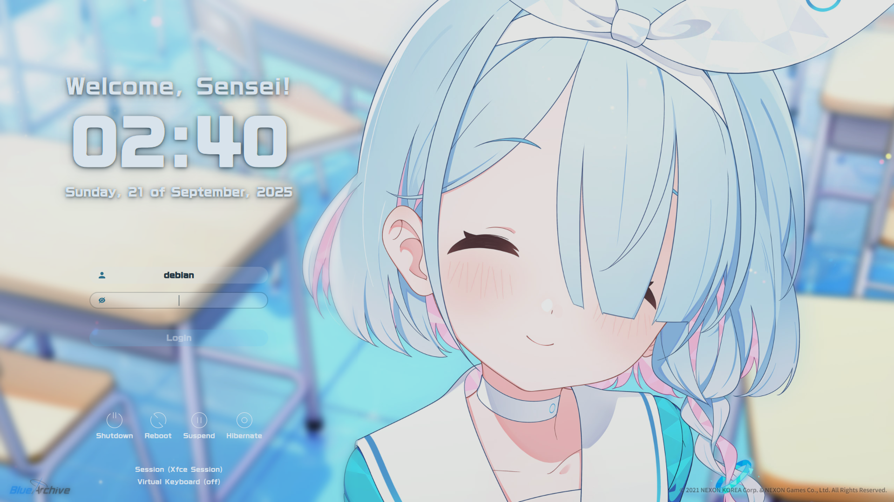

# sddm-arona-theme

[](https://ko-fi.com/dungdinhmanh)

[sddm-arona-theme](https://github.com/dungdinhmanh/sddm-arona-theme) is a fork of the [sddm-astronaut-theme](https://github.com/Keyitdev/sddm-astronaut-theme) for [SDDM](https://github.com/sddm/sddm/) display manager made by **[Keyitdev](https://github.com/Keyitdev)**.

It's written using the latest version of Qt, which is **Qt6**. Its key features include **virtual keyboard support** and an **installation script**. This theme also support **animated wallpapers**. You can easily change its appearance by choosing another of the ten pre-made themes or creating your own. Each of these themes was created by modifying just one file - **[config](./Themes/arona_live.conf)**.

All themes were created for 1080p. However, they should work well in other resolutions.

## Preview of static theme



## Preview of live themes
https://github.com/user-attachments/assets/d8b0005b-43aa-4df5-b0b6-49223a5b973c

## Installation

### Automatic Installation

```sh
sh -c "$(curl -fsSL https://raw.githubusercontent.com/dungdinhmanh/sddm-arona-theme/master/setup.sh)"
```
> Works on distributions using pacman, xbps-install, dnf, zypper.   
> Remember to always read the scripts you run from the internet.

### Manual Installation

1. Install **dependencies**

[`sddm >= 0.21.0`](https://github.com/sddm/sddm), [`qt6 >= 6.8`](https://doc.qt.io/qt-6/index.html), [`qt6-svg >= 6.8`](https://doc.qt.io/qt-6/qtsvg-index.html), [`qt6-virtualkeyboard >= 6.8`](https://doc.qt.io/qt-6/qtvirtualkeyboard-index.html), [`qt6-multimedia >= 6.8`](https://doc.qt.io/qt-6/qtmultimedia-index.html)

You may also want to install additional video codecs like h.264.

```sh
sddm qt6-svg qt6-virtualkeyboard qt6-multimedia-ffmpeg     # Arch
sddm qt6-svg qt6-virtualkeyboard qt6-multimedia            # Void
sddm qt6-qtsvg qt6-qtvirtualkeyboard qt6-qtmultimedia      # Fedora
sddm-qt6 libQt6Svg6 qt6-virtualkeyboard qt6-virtualkeyboard-imports qt6-multimedia qt6-multimedia-imports        # OpenSUSE
sddm libqt6svg6 qt6-svg-plugins qt6-virtualkeyboard-plugin libqt6multimedia6 qml6-module-qtquick-controls qml6-module-qtquick-effects libxcb-cursor0  # Debian
```

2. Clone this repository
```sh
sudo git clone -b master --depth 1 https://github.com/dungdinhmanh/sddm-arona-theme.git /usr/share/sddm/themes/sddm-arona-theme
```
3. Copy fonts to `/usr/share/fonts/`
```sh
sudo cp -r /usr/share/sddm/themes/sddm-arona-theme/Fonts/* /usr/share/fonts/
sudo mkdir /etc/sddm.conf.d # Create a folder if not exist
```
4. Edit `/etc/sddm.conf` and `/etc/sddm.conf.d/kde_settings.conf` (If u using debian/not exist this file)
```sh
echo "[Theme]
Current=sddm-arona-theme" | sudo tee /etc/sddm.conf /etc/sddm.conf.d/kde_settings.conf
```
5. Edit `/etc/sddm.conf.d/virtualkbd.conf`
```sh
echo "[General]
InputMethod=qtvirtualkeyboard" | sudo tee /etc/sddm.conf.d/virtualkbd.conf
```

## Selecting a theme

You can select theme by editing [metadata](./metadata.desktop) (`/usr/share/sddm/themes/sddm-arona-theme/metadata.desktop`).

Just edit this line:
```
ConfigFile=Themes/arona_live.conf
```
All available configs are in [Themes](./Themes/) directory.

## Previewing a theme

You can preview the set theme without logging out by runnning:
```sh
sddm-greeter-qt6 --test-mode --theme /usr/share/sddm/themes/sddm-arona-theme/
```
> Note that depending on the system configuration, the preview may differ slightly from the actual login screen.

## Sources

This theme is edited base on [sddm-astronaut-theme](https://github.com/Keyitdev/sddm-astronaut-theme) by [Keyitdev](https://github.com/Keyitdev)

## Supporting project

You can support me simply by dropping a **star** on **[github](https://github.com/dungdinhmanh/sddm-arona-theme)**.

If you enjoyed it and would like to show your appreciation, you can make a donation using **[kofi](https://ko-fi.com/dungdinhmanh)**.

[](https://ko-fi.com/dungdinhmanh)

Distributed under the **[GPLv3+](https://www.gnu.org/licenses/gpl-3.0.html) License**.    
Copyright (C) 2025 dungdinhmanh.
